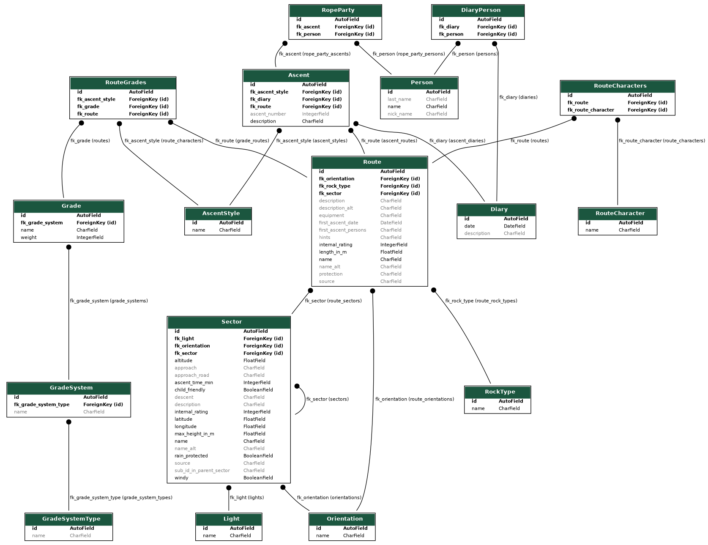
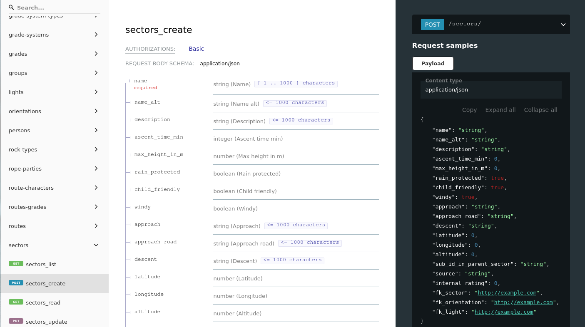

# OpenClimbingDB

OpenClimbingDB is a hobby project for exposing an open database,
so i can log my climbing routes.

The software is written in python with the power of django, to
learn about that. Never used it before.

The basic data is not feeded manualy. It is crawled from different
existing websites. I united them, so that i don't have to log in 
each in seperate for distributed logging.

Thanks to all website providers for there informations.

Crawling for this project is not intented to be in context of (D)DOS.
I will try not to make too many requests to your servers so that the 
running operation is not affected.

- [OpenClimbingDB](#openclimbingdb)
  - [Current Database-Design](#current-database-design)
  - [Requirements](#requirements)
  - [Getting Started](#getting-started)
  - [Development](#development)
    - [Django](#django)
      - [Migrations](#migrations)
      - [Update Entity Relation Diagram (ERD) of current database implementation](#update-entity-relation-diagram-erd-of-current-database-implementation)
      - [Remove Data From DB](#remove-data-from-db)
  - [Crawling](#crawling)
  - [API](#api)
  - [About the author](#about-the-author)

## Current Database-Design



## Requirements

Tested with python 3.9.2

## Getting Started

``` bash
# get the project
git clone https://github.com/keilWolf/OpenClimbingDB

# create a virtual environment for python
python -m venv venv

# activate your new environment
source ./venv/bin/activate

# install the dependencies
pip install -r requirements.txt

# create a superuser for development/production
python manage.py createsuperuser --email *** --username ***

# apply the current migrations for the database 
python manage.py migrate

# start the django-application and expose the database
python manage.py runserver
```

## Development

Pre-Commit hooks are used to format code with `black` and check code quality with `flake8`.

Simply install after dependencies are installed.

``` bash
pre-commit install
```

### Django

The project is powered by `django` and the `django-rest-framework`.

- [Django](https://www.djangoproject.com/)
- [Django-Rest-Framework](https://www.django-rest-framework.org/)

#### Migrations

If you change something for the database like the model or co. You have to create some migration file with `makemigrations` and `migrate` afterwards.

``` bash
python manage.py makemigrations
python manage.py migrate
```

#### Update Entity Relation Diagram (ERD) of current database implementation

```bash
python manage.py graph_models ocdb -o ./docs/ocdb_db.png
```

#### Remove Data From DB

!!! ATTENTION !!!
!!! Example Will Remove All Sector Entries !!

```bash
python manage.py dbshell
...
DELETE FROM ocdb_sector;
```

## Crawling

Database data is mainly crawled data with `scrapy`.

See also [Crawler-Readme](./crawler/README.md).

## API

Usage of redoc with `drf-yasg`

https://github.com/axnsan12/drf-yasg/

``` bash
# start application
python manage.py runserver

# open your browser
firefox http://localhost:8000/redoc/
```



## About the author

Wolfram Keil
