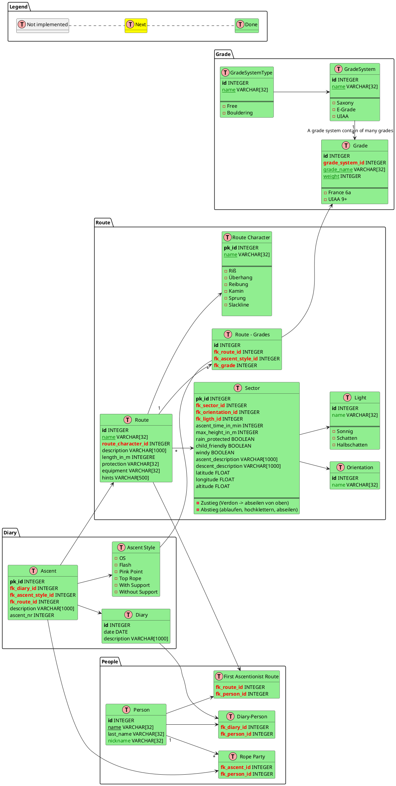

# Open Climbing DB - Schema

```plantuml
@startuml
left to right direction

' uncomment the line below if you're using computer with a retina display
' skinparam dpi 300
!define Table(name,desc) class name as "desc" << (T,#FFAAAA) >>
' we use bold for primary key
' green color for unique
' and underscore for not_null
!define primary_key(x) <b>x</b>
!define foreign_key(x) <b><color:red>x</color></b>
!define unique(x) <color:green>x</color>
!define not_null(x) <u>x</u>
' other tags available:
' <i></i>
' <back:COLOR></color>, where color is a color name or html color code
' (#FFAACC)
' see: http://plantuml.com/classes.html#More
hide methods
hide stereotypes

package Legend {
    together {
        Table(Missing, "Not implemented")
        Table(Done, "Done") #lightgreen
        Table(Next, "Next") #yellow

        Missing .. Next
        Next .. Done 
    }
}


package Grade {
    Table(grade_system_type, "GradeSystemType") #lightgreen {
        primary_key(id) INTEGER
        not_null(unique(name)) VARCHAR[32]

        ===
        - Free
        - Bouldering
    }

    Table(grade_system, "GradeSystem") #lightgreen {
        primary_key(id) INTEGER
        not_null(unique(name)) VARCHAR[32]

        ===
        - Saxony
        - E-Grade
        - UIAA
    }

    grade_system_type --> grade_system


    Table(grade, "Grade") #lightgreen{ 
        primary_key(id) INTEGER
        foreign_key(grade_system_id) INTEGER
        not_null(unique(grade_name)) VARCHAR[32]
        not_null(unique(weight)) INTEGER

        ===
        - France 6a
        - UIAA 9+
    }

    grade_system "1" -> "*" grade : A grade system contain of many grades
}

package Route {

    Table(route, "Route")#lightgreen{
        primary_key(id) INTEGER
        not_null(unique(name)) VARCHAR[32]
        foreign_key(route_character_id) INTEGER
        description VARCHAR[1000]
        length_in_m INTEGERE
        protection VARCHAR[32]
        equipment VARCHAR[32]
        hints VARCHAR[500]
    }

    Table(route_extra_grades, "Route - Grades") #lightgreen{
        primary_key(id) INTEGER
        foreign_key(fk_route_id) INTEGER
        foreign_key(fk_ascent_style_id) INTEGER
        foreign_key(fk_grade) INTEGER

    }

    Table(route_character, "Route Character") #lightgreen {
        primary_key(pk_id) INTEGER
        not_null(unique(name)) VARCHAR[32]

        ===
        - Riß
        - Überhang
        - Reibung
        - Kamin
        - Sprung
        - Slackline

    }


    Table(sector, "Sector") #lightgreen {
        primary_key(pk_id) INTEGER
        foreign_key(fk_sector_id) INTEGER
        foreign_key(fk_orientation_id) INTEGER
        foreign_key(fk_ligth_id) INTEGER
        ascent_time_in_min INTEGER
        max_height_in_m INTEGER
        rain_protected BOOLEAN
        child_friendly BOOLEAN
        windy BOOLEAN
        ascent_description VARCHAR[1000]
        descent_description VARCHAR[1000]
        latitude FLOAT
        longitude FLOAT
        altitude FLOAT

        ===
        - Zustieg (Verdon -> abseilen von oben)
        - Abstieg (ablaufen, hochklettern, abseilen)
    }

    Table(orientation, "Orientation") #lightgreen {
        primary_key(id) INTEGER
        unique(name) VARCHAR[32]
    }


    Table(light, "Light") #lightgreen {
        primary_key(id) INTEGER
        unique(name) VARCHAR[32]

        ===
        - Sonnig
        - Schatten
        - Halbschatten
    }

    route --> route_character
    route "*" --> sector
    sector --> orientation
    sector --> light
}

package Diary {

    Table(diary, "Diary") #lightgreen {
        primary_key(id) INTEGER
        date DATE
        description VARCHAR[1000]
    }

    Table(ascent, "Ascent")#lightgreen{
        primary_key(pk_id) INTEGER
        foreign_key(fk_diary_id) INTEGER
        foreign_key(fk_ascent_style_id) INTEGER
        foreign_key(fk_route_id) INTEGER
        description VARCHAR[1000]
        ascent_nr INTEGER
    }

    Table(ascent_style, "Ascent Style") #lightgreen {
        - OS
        - Flash
        - Pink Point
        - Top Rope
        - With Support
        - Without Support
    }

    ascent --> ascent_style
    ascent --> route
    ascent --> diary
}

package People {

    Table(person, "Person") #lightgreen {
        primary_key(id) INTEGER
        not_null(name) VARCHAR[32]
        last_name VARCHAR[32]
        unique(nickname) VARCHAR[32]
    }

    Table(diary_person, "Diary-Person") #lightgreen {
        foreign_key(fk_diary_id) INTEGER
        foreign_key(fk_person_id) INTEGER
    }

    Table(rope_party, "Rope Party")#lightgreen{
        foreign_key(fk_ascent_id) INTEGER
        foreign_key(fk_person_id) INTEGER
    }

    Table(first_ascentionist_route, "First Ascentionist Route")#lightgreen{
        foreign_key(fk_route_id) INTEGER
        foreign_key(fk_person_id) INTEGER
    }

    person --> first_ascentionist_route 
}

' Cross dependencies

diary --> diary_person
person --> diary_person
person "1" --> "*" rope_party 
ascent --> rope_party

route "1" --> "*" route_extra_grades
route --> first_ascentionist_route
route_extra_grades -- ascent_style
route_extra_grades --> grade


' relationships
' ------------------
' many to many relationship
' user "1" -left-> "*" group : "A user may be \nin many groups"
'
' one to many relationship
' user --> read : "A user may have \n many books read"
'
' one-to-one relationship
' user -- user_profile : "A user only \nhas one profile"
@enduml
```